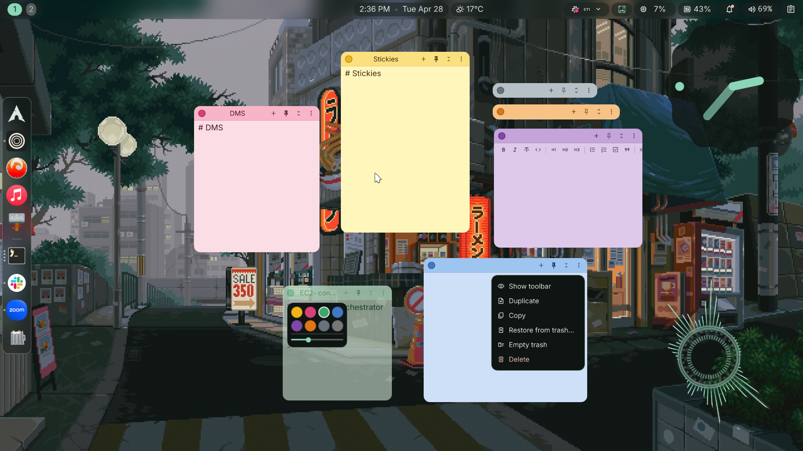

# DMS Stickies

A Stickies-style notes plugin for [DankMaterialShell](https://github.com/AvengeMedia/DankMaterialShell). Free-floating, draggable, resizable note windows that live on the desktop layer by default and can be pinned over other windows. Markdown source with a formatting toolbar, per-note accent colors, fold/unfold, save-to-disk as `.md`.

---


## Install

Symlink (or copy) into the DMS plugins directory. From inside the plugin folder:

```bash
ln -sf "$PWD" ~/.config/DankMaterialShell/plugins/dmsStickies
```

In DMS(unreleased):

1. **Settings → Plugins** → click **Scan for Plugins** → enable **DMS Stickies**.
2. **Settings → Desktop Widgets** → add an instance of **DMS Stickies**.

A blank yellow sticky appears on your desktop.

> **Note:** This plugin requires two small PRs (both merged upstream): `acceptsKeyboardFocus` (so clicks-to-type work) and a `screen` property injection (used for left-click drag, spawn-beside, and per-screen fold). The plugin will load without them but those features won't work.

## Usage

### Editing

- **Left-click** the body to focus and type.
- The toolbar above the editor toggles **bold / italic / strikethrough / inline code**, headings (**H1 / H2 / H3**), **bulleted / numbered / checkbox / quote** prefixes, and **link** insertion. All toggles are idempotent — clicking Bold on already-bolded text removes the markers.

### Title bar

- **Title** — derived from the first non-empty line of the note content (markdown heading hashes stripped), elided if too long.
- **Color swatch** → opens accent picker (8 colors) + opacity slider. Opacity is per-sticky, persisted in `pluginData.alpha` (range 20–100%).
- **+** → spawns a new sticky beside the parent (cascades down-right if there's no room), inheriting color and pin state with a blank body. Works across screens: in sync mode places relative to `_synced` position; in per-screen mode places per-screen relative to each screen's parent location.
- **Pin** → flips between desktop layer and overlay layer (always-on-top).
- **Fold** → collapses to the title bar; remembers the unfolded height. Animation provided by QML on Niri, by the compositor on Hyprland. When near the bottom of the screen with no room to grow downward, anchor flips so the body grows upward instead.
- **⋯** → menu: Hide/Show toolbar · Duplicate · Copy · Restore from trash · Empty trash · Delete. "Empty trash" requires a two-click confirmation. Click anywhere outside the menu/popover to dismiss.

### Movement

- **Left-click + drag** the title bar to move (excludes the buttons).
- **Right-click + drag** anywhere on the sticky to move it (the wrapper's built-in path).
- **Right-click + drag the bottom-right corner** to resize.
- **Double-click the title bar** → fold / unfold.
- Position and size are persisted per-screen, per-instance. When "Sync Position Across Screens" is enabled, the same sticky moves on every monitor.

### Per-screen fold (sync OFF)

When **Sync Position Across Screens is OFF** for a sticky shown on multiple monitors, fold state is per-screen — folding on monitor A doesn't fold the mirror on monitor B. When sync is ON, fold state is shared across monitors.

### Active-state opacity

A sticky goes **fully opaque** while it's "active" — the editor has focus *or* the cursor is hovering anywhere over the sticky. When inactive (no focus, cursor away), it fades to the configured opacity.

## Storage

Each sticky's content lives as a real markdown file:

```
~/.local/share/DankMaterialShell/stickies/
  notes/<instanceId>.md       # active sticky content
  trash/<instanceId>.md       # soft-deleted, recoverable via "Restore from trash…"
```


## Known limitations

### Within-layer ordering on Niri

Layer-shell surfaces have a stable Z-rank within their layer, assigned by Niri at surface creation and held for the lifetime of the wayland surface. Drag-induced layer transitions (`Bottom → Overlay → Bottom`) raise the dragged sticky during the drag but Niri restores its original within-`Bottom` rank on release.

Practical consequences:

- **Two unpinned stickies**: dragged-on-top renders above during the drag, snaps back to its original rank on release.
- **Two pinned stickies**: both live on `Overlay` permanently, no transition ever happens, ordering is whatever Niri assigned at creation time.
- **Pinned vs. unpinned**: the pinned one always wins (different layers).

Pin is the sanctioned way to bring a sticky to the front. Long-term path is a Niri upstream feature request for layer-shell surface raise; not pursued here.

## Roadmap

Done:
- [x] Skeleton (single sticky, drag, resize, position persistence)
- [x] Markdown editor + on-disk persistence + multi-monitor sync
- [x] Title bar with pin / fold / accent color
- [x] `+` to spawn new sticky, delete-to-trash with restore
- [x] Markdown editor toolbar
- [x] Per-sticky toolbar toggle + Empty trash with two-click confirmation
- [x] Title-bar label from first content line
- [x] Left-click drag on title bar
- [x] Double-click title bar to fold/unfold
- [x] Click-outside dismisses popovers
- [x] Per-screen fold state when sync is OFF
- [x] Spawn-new-sticky-beside-parent (per-screen)
- [x] Anchor-bottom fold animation when sticky is near screen bottom
- [x] Per-sticky opacity (slider in the color popover, perceptual curve so body and title bar fade in lockstep)
- [x] Active-state opacity boost (fully opaque on focus/hover, fades on blur, preview-while-dragging suppression)
- [x] Custom caret delegate (matches palette text color)

## Backlog
- [ ] Image paste & inline rendering
- [ ] Basic keyboard shortcuts (toolbar actions, fold, pin, etc.)
- [ ] Lock Y-axis resize while folded — wrapper has no max-height hook; snap-back from plugin side (`heightChanged` debounce or `SettingsData.desktopWidgetInstancesChanged` Connections) doesn't reliably catch drag-release on Niri. Needs upstream wrapper change to expose either a max-height or an `interactive`/`isInteracting` signal so the plugin can detect drag-end deterministically.
